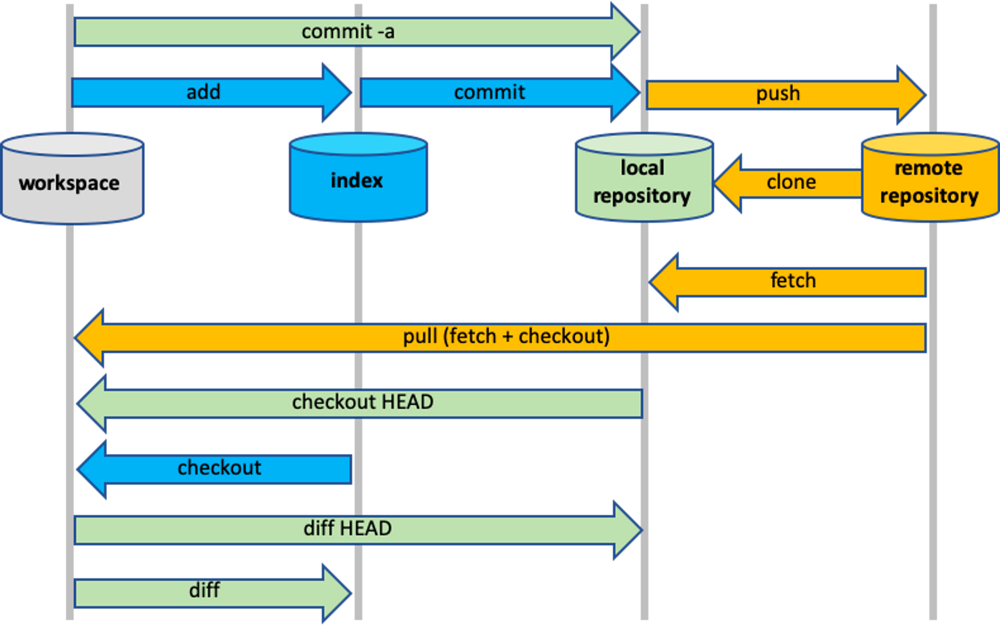

## 작업공간

- workspace

  - 우리가 작업하는 일반적인 공간 git을 쓰기 이전 처음 상태이다.
  - git add 명령어 이전에는 변경사항들은 workspace에 기록됩니다.

- index(stage)

  - 변경되는 모든 파일 및 폴더들을 추적하는 공간입니다. staging area라고도 이야기합니다.
  - **git add** 명령어로 workspace공간에 있는 작업물을 이 공간으로 보낼 수 있습니다.
  - 우리가 관심 있고, 최종적으로 커밋하고자 하는 작업물들을 이 공간으로 두면 됩니다.
  - 한번 index에 올라갔던 파일들은 git에서 계속해서 추적합니다.

- local repository

  - 최종적으로 커밋된 작업물들을 놇이게 되는 공간
  - **git commit** 명령어로 index에 있는 파일들을 이 공간으로 보낼 수 있다.
  - 최종적으로 우리가 작업한 내용이 이 공간에 기록됨!

- remote repository
  - 일명 git 호스팅 공간으로, 인터넷으로 연결된 별도의 공간입니다. 최종 작업물들을 여기에 저장하고 다른 사람들과 공유합니다.
  - 여러 사람이 같이 협업할 때 이 공간을 사용합니다.
  - **git push** 명령어로 local repository에 있는 작업물을 이 공간으로 보낼 수 있다.
  - **git fetch**나 **git pull** 명령어로 이 공간에 있는 작업물을 local repository로 가져올 수 있다.
  - 이 공간에 있는 작업물들을 보통 협업에서 가장 최신 버전의 작업물이라고 간주함
  - Github, Bitbucket, GitLab 등이 이 공간을 구현한 Git 호스팅 서비스이다.
