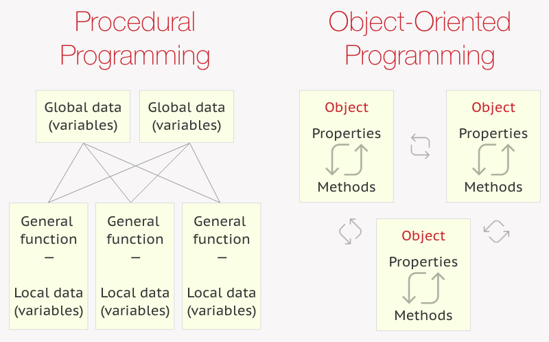

## Procedural paradigm



- 함수 : procedure
- 프로그램이 순차적으로 단계별로 진행되고 변수들은 공통변수는 전역으로 그 외의 것들은 지역변수로 만들어서 잠깐잠깐 사용한다.
- Procedure Oriented Programming 은 procedure call, 즉 함수 호출을 중심으로 프로그래밍을 생각하는 것이다.
- 재사용 가능한 코드들은 별도의 함수로 분리하고 함수 간의 호출로 하고자 하는 일을 수행합니다. 이런 프로세스는 주로 "함수" 와 "조건물", "루프문" 을 활용하여 코드를 구성합니다.
- Procedure Oriented Programming은 대아토룰 중앙 집중식으로 관리합니다. 즉 프로세스 로직과 데이터가 별도의 위치에 분리되어 있습니다. 프로세스 로직 부분에서는 어떤 데이터가 들어오는지 모르기 때문에 로직 내에 조건문 사용이 많은 경향이 있다.

```
def read_input_file(file_path: str) -> str:
    if file_path.endswith(".txt"):
        reader = get_file_reader(file_type="txt")
        return reader.read(file_path)
    elif file_path.endswith(".csv"):
        reader = get_file_reader(file_type="csv")
        return reader.read(file_path)
    elif file_path.endswith(".xlsx"):
        reader = get_file_reader(file_type="xlsx")
        return reader.read(file_path)
    else:
        raise ValueError("파일 확장자는 txt, csv, xlsx 중 하나여야 합니다.")

def get_file_reader(file_type: str) -> Reader:
    if file_type == "txt":
   		...
    elif file_type == "csv":
        ...
    elif file_type == "xlsx":
        ...

def parse_input_data(data: str) -> List[str]:
    ...

def save_data(data: List[str]) -> None:
    ...

def main() -> None:
    data = read_input_file("input_file.txt")
    parsed_data = parse_input_data(data)
    save_data(parsed_data)

if __name__ == "__main__":
    main()
```

- main 함수는 하위 함수들의 호출로 이루어져 있습니다. main함수만 보면 이 프로그램이 전체적으로 어떤 일을 하는지 쉽게 파악할 수 있습니다. 절차지향 코드는 이렇게 전체 로직은 작은 함수 단위로 나누고 프로그래밍 메인 로직이 시작되는 곳부터 하위 로직이 실행되는 곳까지 TOP->DOWN 식으로 구성되곤 합니다.

- 장단점

  - TOP->Down 식이고, 로직이 복잡한 것이나 계속해서 기능을 확장해나가야 하는 것이 아니라면 유지보수도 용이하다.
  - 전체 로직이 복잡하거나 동적으로 로직을 바꿔야 하는 등의 기능 확장이 필요할 때 유지 보수하기가 어려워집니다.
  - 또한 데이터와 함수가 분리되어 있기에 함수가 많아질수록 데이터의 변경 사항을 추적하기도 어렵다..

  - 따라서, 절차지향은 프로그램이 수행하는 알고리즘이 명확하고, 기능 확장 등이 자주 일어나지 않는 상황에서 사용하기에 좋습니다.
